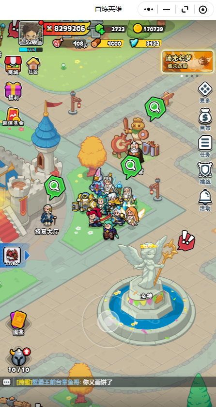
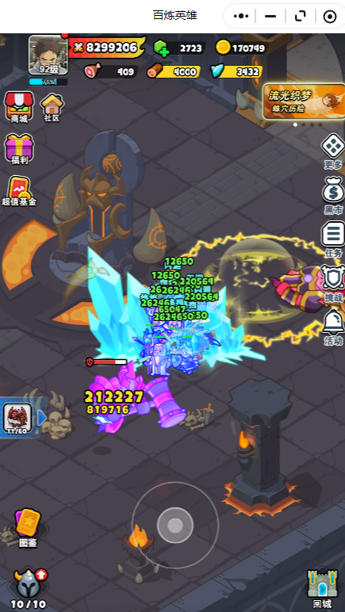

## Description:

This game script was developed to free my hands. Learn automation operations, Pyqt, 
and enhance project engineering skills through this project.Even in the future, image analysis will be used 
for more accurate recognition calculations.

* Resolution support 1920 * 1080
* Only supports fixed main window position
* For learning purposes only, without commercial purposes

###  Existing abilities
* Daily reward collection
* Automatic PK
* Automatically brush wood resources
* Automatically brush daily treasure chests
* Automatic card drawing

###  Game Feature

Monster- F4

###  The next step
1. Build software interface
2. Add resource brushing routes
3. Adapt to computers with more resolutions