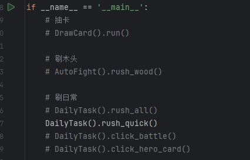

## Description:

This game script was developed to free my hands. Learn automation operations, Pyqt, 
and enhance project engineering skills through this project.Even in the future, image analysis will be used 
for more accurate recognition calculations.

* Resolution support 1920 * 1080
* Only supports fixed main window position
* For learning purposes only, without commercial purposes

## Usage

There are actually no specific version requirements, as the script currently only requires two third-party packages: PyQt5 for the interface and pyautogui for mouse operation. My Python version is *3.10.14*. If necessary, you can also use my pre-set *requirement. txt* for installation.

```shell
pip install -r requirement.txt
```

**How to use the scripts?**

At present, the corresponding functions can only be executed through/src/*mailian.py*. I will continue to connect the UI interface and script code in the future. Coming soon.



###  Existing abilities
* Daily reward collection
* Automatic PK
* Automatically brush wood resources
* Automatically brush daily treasure chests
* Automatic card drawing

###  Game Feature


Monster- F4


###  The next step
1. Joint debugging software and scripts
2. Add resource brushing routes
3. Adapt to computers with more resolutions